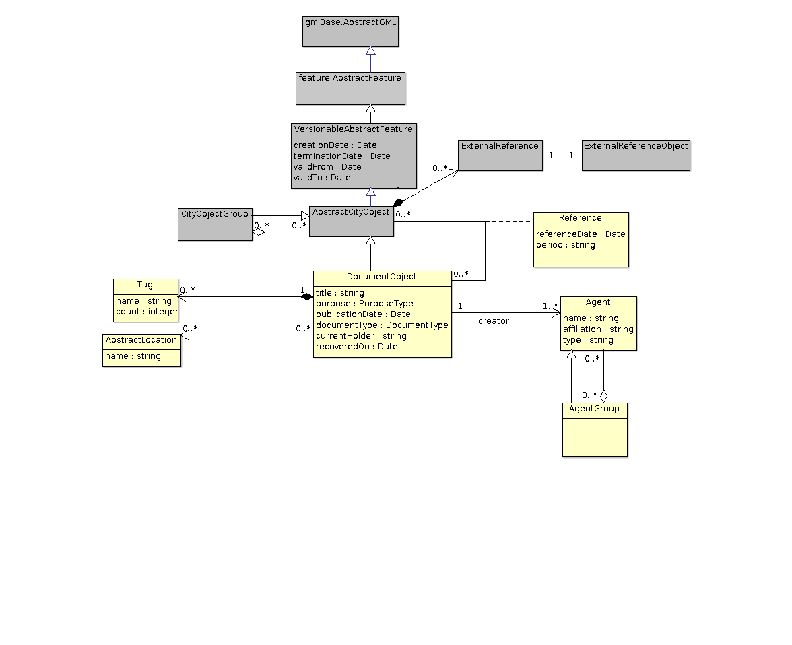

# Document ADE

# Current Proposition
#### Publication Date: March 18, 2016

## Open Problems
- What's the precise definition of a referring date?
- Shouldn't there be many referring dates for a particular city object in a document? 
- Do we require any other attributes to describe a reference? What is the purpose of the reference? Is it an imaginary project or date?
- Do we need to specify producerType, heldByType (to specify whether they are official/non official/private sources)?

## Evolution of Document ADE
### First proposition 
#### Publication Date: March 3, 2016
After understanding the requirements specified by Clémentine Périnaud, the following UML diagram was proposed.

#### Open Problems
Following the discussion with Clémentine Périnaud, further questions were raised and following are the open problems.
- Is the above diagram generic enough?
- Why just Inconography directory and not text directory or plan directory?
- Is there any need for the exhaustive list of formats?
- How to classify source? official/non-official?
- A document may refer to a period or any other particular date? What is it referring to?
- What about various possible scenarios. A document may be present in a version of the scenario and may not be present in another.
- How to specify external references(if any) to the document?
- How to capture the idea that the producer of the document may not be the current owner of the document? Example postal cards by (anonymous) photographers are currently held by some private individual(s) or public institutions like museums.
- Missing ability to specify (user-generated) tags for a document.
- Some documents may or may not be accessible, in the sense that we may not have the complete text. For such non-accessible documents, we may only have the keywords (key-phrases) and the associated count of their occurrences in the document.
- A document may have a purpose: related to the construction, demolition. But an exhuastive list of purposes need to be discussed.

### Second Proposition 
#### Publication Date: March 15, 2016
After considering CityGML ADE, the above requirements have been incorporated to the CityGML model.
- A document may or may not have an associated shapefile.
A document may refer to an abstract location, i.e., the city of Giors, or a particular sector in a city, the boundaries of which may not be clear since the reference may have been used in a generic manner.
By deriving DocumentObject from AbstractCityObject (which in turn inherits from VersionableAbstractFeature), we inherit attributes like identifier, creationDate, publicationDate, and the possibility to specify any external reference of the document.
This derivation also permits to create a directory of documents (Refer CityObjectGroup).
- Two classes called Agent and AgentGroup have been added to specify the creator (or producer) of a document. AgentGroup is a group of agents. Example two or three persons in the municipal council talking on a particular topic. AgentGroup derives from Agent, therefore we may have groups of AgentGroups and so on.
- New attributes like currentHolder and recoveredOn have been added to specify the current owner of a document.
Another attribute called purpose have been added with a type 'PurposeType' to specify the purpose of a document.
'documentType' is used to specify the format of a document.
- A document may have _Tag_s.
- A document may refer any other AbstractCityObject (on a particular date of past/future or a period) and this is captured by the association class 'Reference'.
- A separate class called 'AbstractLocation' has been added to associate a document to abstract locations like city, quarter which cannot be specified in CityGML.

#### Open Problems
- Why do we need to create a class called Agent or Agent Group, instead of giving a reference to the external data source which may have all the details?
- Is there really need for the AbstractLocation class? 

### Third proposition
#### Publication Date: March 18, 2016
AbstractLocation, Agent, AgentGroup have been removed.
New attribute called producer have been added to specify the producer of the document.
For all the details concerning a document, the externalReference is being used. 
DocumentType has been replaced by gml:codeType (considering CityGML 2.0 changes).
referringDate and referringPeriod makes use of gml:TimeInstant and gml:TimePeriod respectively.
purpose is now a string to support various possibilities.

#### Open Problems
- What's the precise definition of a referring date?
- Shouldn't there be many referring dates for a particular city object in a document? 
- Do we require any other attributes to describe a reference? What is the purpose of the reference? Is it an imaginary project or date?
- Do we need to specify producerType, heldByType (to specify whether they are official/non official/private sources)?
