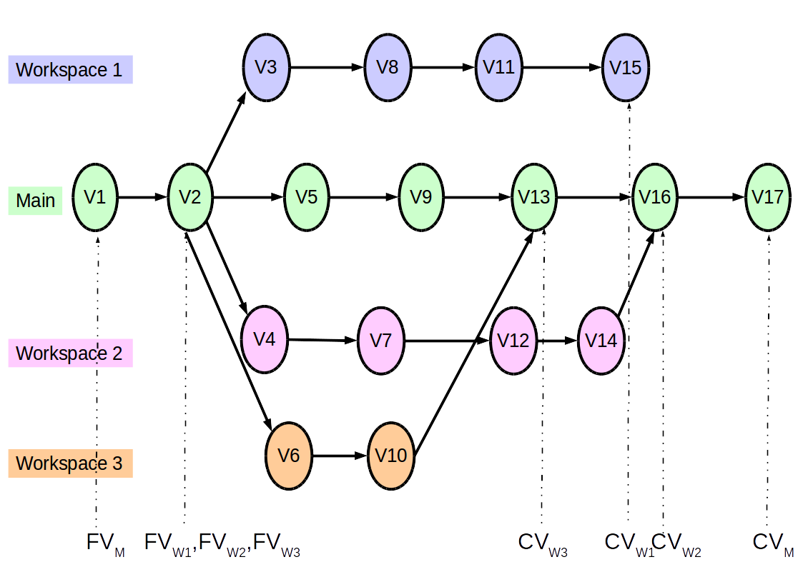
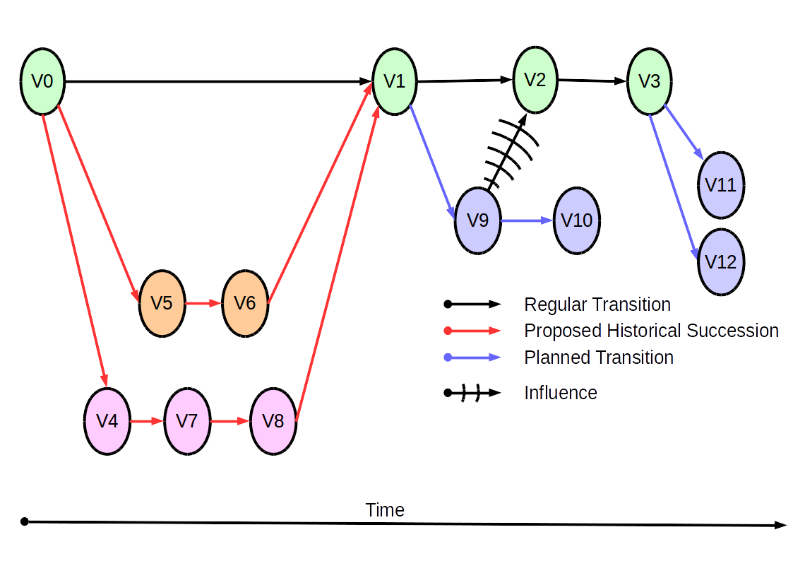
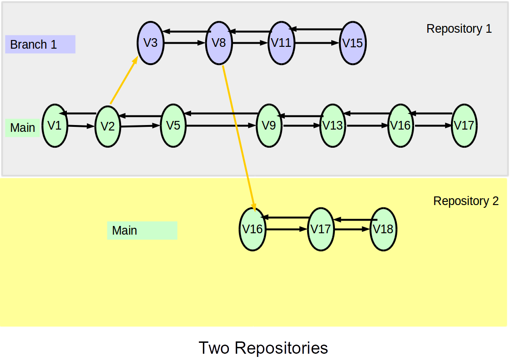
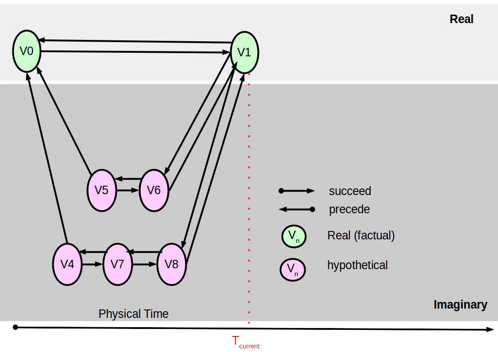
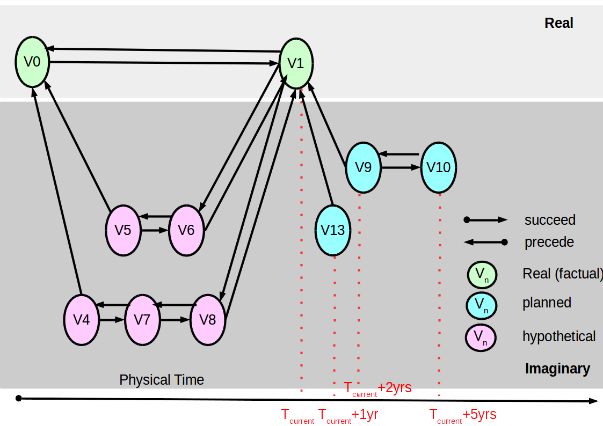
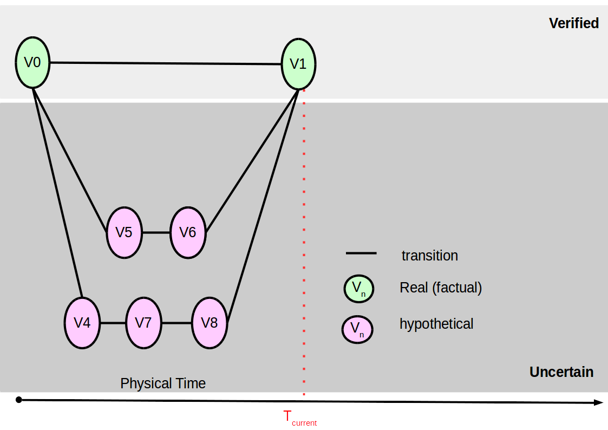
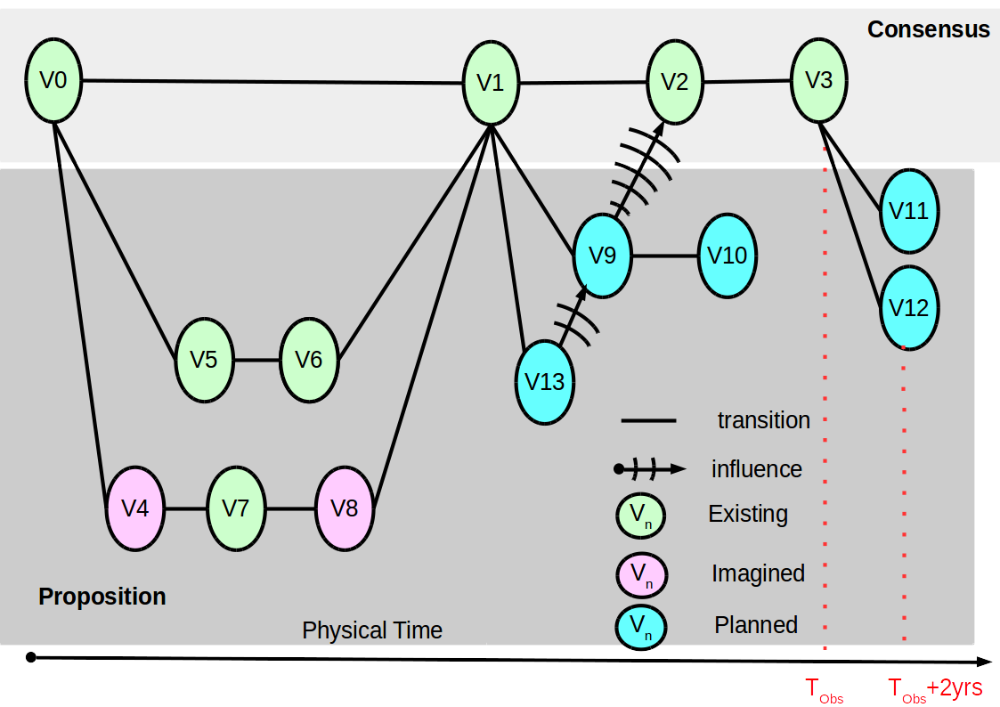
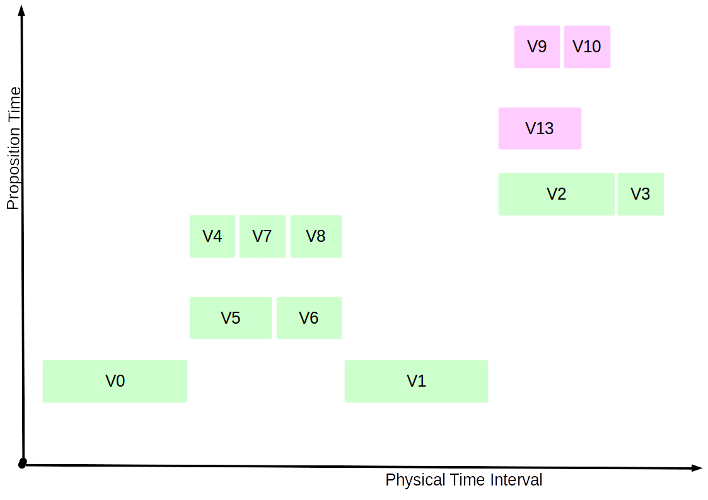

# Workspace ADE

Management of workspaces in CityGML.
**Goal**: Help multiple researchers to propose and share various hypothesis and future urban plans for changes occurring in a specified location of interest

In a team involving several researchers from different domains proposing various hypothesis and future plans using CityGML files, one important requirement is to be able to save, track and manage these propositions. 
Another major requirement is the ability to easily exchange these propositions with other researchers in an interoperable manner. 
WorkspaceADE is a step towards this direction.
It permits the researchers to propose their hypothesis and urban plans using CityGML and also be able to easily exchange them with each other.
This page explains the evolution of this Workspace ADE proposition.
Note that, we want the approach to be generic enough so that we can deploy other options like distributed version control systems, semantic web technologies to test this proposition.

## Evolution of Workspace ADE
### Proposition v0.1 
#### Description
It makes use of [CSG16] to propose workspaces.
[CSG16] suggested making use of 'tags' to create user specific workspaces for hypothesis.
Our proposition is to add a new class to represent the details of workspaces like name, owner and, creation date.
Workspaces are owned by individual users.
A workspace called 'Main' is used as a reference workspace.
Other workspaces may propose any changes from the Main workspaces.
In order to track a workspace, two pointers are used, the first version and the current version.
First version corresponds to the starting version of the workspace.
Current Version points to the latest version on a given workspace.

#### Limitations
* Unable to distinguish between hypothesis (past) and future urban plans
* Unable to distinguish between different types of transitions proposed in [CSG16]

[CSG16] C HATURVEDI K., S MYTH C. S., G ESQUIÈRE G., K UTZNER T., K OLBE T. H.: Managing versions and history within semantically enriched 3d city models. Advances in 3D Geoinformation, Lecture Notes in Cartography and Geoinformation, Springer, 2016

### Proposition v0.2 
#### Description
Add  the notion of past and future considering the current time
* Hypothesis concerns the past
* Plans concerns the future

Add different types of version transitions
* Regular Transition (Transitions occurring in the main workspace)
* Proposed Historical Succession (A transition from a version of the main workspace to a version used to describe hypothesis)
* Proposed Historical Regular Transition (Transition between versions used to describe hypothesis)
* Validated (A transition from the version used to describe hypothesis to a version in the Main workspace)
* Planned (A transition from a version in the main workspace to a version used to describe future plans)
* Planned Regular Transition (Transitions between versions used to describe future plans)
* Realized (A transition from the version used to describe future plans to a version in the Main workspace)

#### Limitations
* Too many types of version transitions (complex).
* Missing notion to represent when any proposed future plans impact something in the main workspace 

### Proposition v0.3 
#### Description
Reduce the number of version transitions and include a transition that can explain an influence of a future plan on the main workspace
* Regular Transition (Transitions between versions of the main workspace)
* Proposed Regular Transition (Transition between versions of the past hypothesis)
* Planned Transition (Transition between versions of the future plans)
* Influence (Hypothetical transition to display the influence of a future plan on the main workspace)

#### Limitations
* Are we really reinventing the wheel? Comparison to version control systems required
* Are version control systems enough to represent our requirements?

### Proposition v0.4 

#### Version Control Systems
There are two types [OS09]
* Centralized Version Control Systems like CVS, SVN (Central repository)
* Decentralized Version Control Systems like git (No central repository, but distributed repositories)

[OS09] Otte, S. (2009). Version Control Systems. Computer Systems and Telematics.

Git is an example of distributed version control systems. 
We continue it as our reference since it exactly suits our requirements where multiple teams (in different laboratories) propose different hypothesis and future plans on a commonly agreed CityGML file (main worskspace)

Git has branches where users can propose their own changes which may or may not be the same from the changes proposed in the main branch.
Every version maintains a pointer to the parent version, if any.
When two branches need to merge, the new version has a pointer to the versions of the two branches from which the new version has been created.

#### Our Requirements
We need to be able to have a representation that can handle the following inspired from [CSG16]
* Feature: Attribute of a city object or a group of city object
* Transaction  (Transaction types: Insert, Delete, Replace)
* Version: Timestamped collection of transactions
* Tag
* Branch
* Workspace

Comparison between our requirements (proposed solution) and existing distributed version control systems like GIT.

#### Discussion
Add the notion of forward and backward transition.
Add new version transitions (use of verbs)
* precede/succeed (transitions between versions of the main workspace)
* hypothesize (transitions between versions used to describe hypothesis)
* plan (transitions between versions used to describe future plans)
* influence (transitions between version used to describe future plan and a version in the main workspace)
* fork (transition between a version in the main branch to the first version used to describe hypothesis or a future plan)
* merge (transition between a version in the main branch to the last version used to describe hypothesis or a future plan)

Furthermore we reuse the notion of branch from distributed version control systems.
A workspace is same as a repository of the distributed version control systems 

#### Limitations
* Need to distinguish between the database creation time of a version, the physical time referred to by a version
* Still we have lots of different types of version transition that make the overall model very complex
* Simplify the examples by considering separate diagrams for the past and future

### Proposition v0.5 
#### Discussion
A workspace is same as a repository of the distributed version control systems.
Reuse the idea of branches from distributed control systems.
Three types of versions are added
* Real
* Planned
* Hypothetical
Three types of version transitions are added
* Precede
* Succeed
* Influence
Distinction has been made between real and imaginary:
* Real is official (reference) and is same as the previously called main workspace
* Imaginary includes both hypotheses and future plans

Versions marked 'Real' is the official state of the concerned (city) object at a given point of time (considering both physical and database creation time).
Versions marked 'Hypothetical' is a hypothetical state of the concerned (city) object at a given point of time proposed by a researcher.
Versions marked 'Imaginary' is a proposed future state of the concerned (city) object at a given point of time proposed by a researcher.

We need to include a reference time to talk about future and past. Tcurrent.
We consider the past the time before Tcurrent like Tcurrent-2yrs.
We consider the past the time before Tcurrent like Tcurrent+2yrs.
(Inspired from GIT implementation) When a branch is created from another version, there is only a single transition 'precede'.
But when two branches merge, we have the transitions in both directions. 

We further question what constitutes a 'Real' situation and an 'Imaginary' situation?
Community decides what is 'Real'? So we need to qualify versions and version transitions so that we may have various possible transitions even in the real world.

#### Limitations
Do we really need to distinguish between precede and succeed version transitions?

### Proposition v0.6 
Two types of version transitions are added
* transition
* influence

Time Diagrams and Interval diagrams to visualize the version (physical) creation time and duration.

### Proposition v0.7 
After further discussion with Clémentine Périnaud, 'Real' and 'Imaginary' situations have been renamed as 'Consensus' and 'Proposition'.
Three types of versions (Existing, Imagined, Planned).
Tcurrent is now TObs (Obs: Observation). 
At a given observation time, versions created before Tobs are marked 'Existing' based on the fact whether they have any real physical existence (in the past).
At a given observation time, versions created before Tobs are marked 'Imagined' based on the fact when they have no real physical existence (in the past) and it's a imagined version (with no material evidence).
At a given observation time, versions are marked 'Planned' based on the fact when they have no real physical existence (in the past) and it's a planned version (with material evidence).

