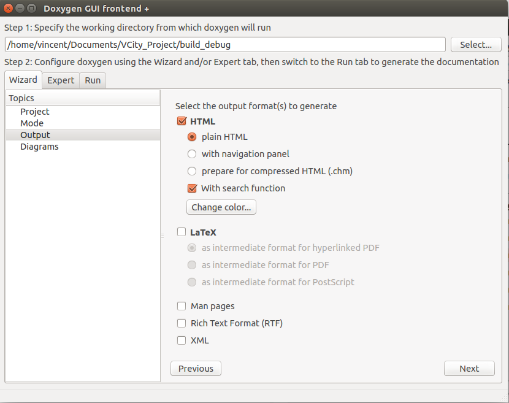
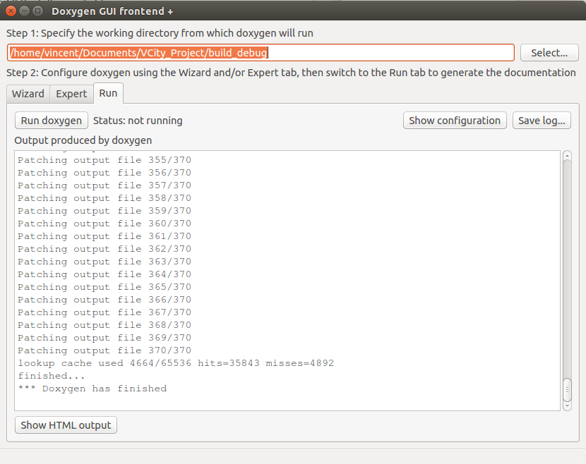

# How to create a doxygen documentation on Ubuntu

## Packages

	sudo apt-get install doxygen
	sudo apt-get install doxygen-gui
	sudo apt-get install graphviz

*Note: Graphviz allows to create graphs to see links and dependencies between classes and libraries of the project.*

## How to create the doc

+ Start the doxygen gui with the following command : `doxywizard`

+ Fill the first window as shown below :

You need to fill the following fields:

Step 1 : Where the doxygen will run from (ie where the builds file will be generated)

Project Name : the name of your project.

Source code directory : The folder where your source files are.

*Note: Scan recursively option can be checked if you want to scan recursively the source code directory.*

Destination directory: where the documentation will be generated.

Then, click next.

- Fill the second window as follow:

Choose All Entities option and include cross-referenced source code in the output.
Depending on the language of your source files, you can optimize the result for it.

Then, click next.

- Fill the third window:

You can choose to generate HTML output and/or LaTeX output, Man pages, RTF and XML files.

Click next again.

- Fill the fourth window:

If you want to generate diagrams of dependencies in your documentation, you can select the "Use dot tool from the Graphviz package option" and check all the graphs you want to generate.

- Go into the run tab on the left:

Click on "Run doxygen" on the upper left corner. 
When generation is donne, click on "Show HTML Output" to see the documentation.

## How to read the documentation

- In the Namespaces tab, you can see all the namespaces and all their class members.

- In the Files tab, you can see all the files and by clicking on them you can see the dependencies graphs.

